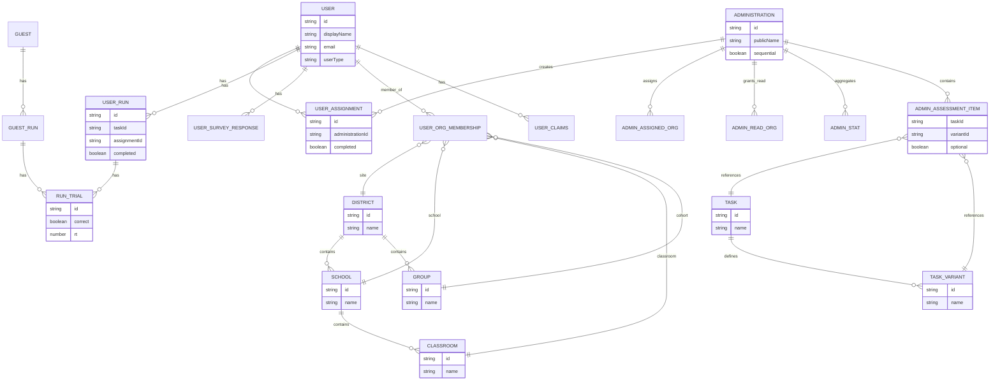

# Levante Firebase Schema (High-Level)

This document summarizes the Firestore data model and how entities interact across
`levante-firebase-functions` and `levante-dashboard`.

Terminology mapping used in the UI:
- assignment (frontend) = administration (backend)
- site = district
- cohort = group
- child/children = student(s)
- caregiver = parent

## Core collections and subcollections

Top-level collections:
- `administrations`
- `users`
- `districts`
- `schools`
- `classes`
- `groups`
- `tasks`
- `userClaims`
- `system`
- `guests`
- `legal`

Key subcollections:
- `users/{uid}/assignments`
- `users/{uid}/runs`
- `users/{uid}/runs/{runId}/trials`
- `users/{uid}/surveyResponses`
- `administrations/{administrationId}/assignedOrgs`
- `administrations/{administrationId}/readOrgs`
- `administrations/{administrationId}/stats`
- `tasks/{taskId}/variants`

Source of collection names: `apps/client/levante-dashboard/src/constants/firebase.ts`.

## ERD (Mermaid)

### ERD legend (Firestore paths)

- `USER_ASSIGNMENT` → `users/{uid}/assignments/{administrationId}`
- `USER_RUN` → `users/{uid}/runs/{runId}`
- `GUEST_RUN` → `guests/{guestId}/runs/{runId}`
- `RUN_TRIAL` → `users/{uid}/runs/{runId}/trials/{trialId}` and `guests/{guestId}/runs/{runId}/trials/{trialId}`
- `USER_SURVEY_RESPONSE` → `users/{uid}/surveyResponses/{administrationId}`
- `ADMIN_ASSIGNED_ORG` → `administrations/{administrationId}/assignedOrgs/{orgId}`
- `ADMIN_READ_ORG` → `administrations/{administrationId}/readOrgs/{orgId}`
- `ADMIN_STAT` → `administrations/{administrationId}/stats/{statId}`
- `ADMIN_ASSESSMENT_ITEM` → `administrations/{administrationId}.assessments[]`
- `USER_ORG_MEMBERSHIP` → `users/{uid}.{districts|schools|classes|groups}.current[]`
- `TASK_VARIANT` → `tasks/{taskId}/variants/{variantId}`

## Entity model (schemas)

### Users (`users`)
Primary identity and org membership for all account types.
- Fields: `displayName`, `email`, `userType`, `assessmentUid`, `roles`, `archived`, `legal`, `testData`
- Org membership: `districts`, `schools`, `classes`, `groups` (each is `OrgAssociationMap`)
- Assignments state: `assignments.assigned|started|completed`
- Admin-only: `adminData.administrationsCreated`

Schema definitions: `apps/server/levante-firebase-functions/functions/levante-admin/firestore-schema.ts`.

### Administrations (`administrations`)
Assignment templates that define tasks/variants and org scope.
- Fields: `assessments[]`, `districts`, `schools`, `classes`, `groups`, `families`, `legal`,
  `readOrgs`, `minimalOrgs`, `siteId`, `sequential`, `publicName`, `tags`, `testData`
- `assessments[]` entries include `taskId`, `variantId`, `variantName`, `params`, `conditions`

Schema definitions: `apps/server/levante-firebase-functions/functions/levante-admin/firestore-schema.ts`.

### Assignments (`users/{uid}/assignments`)
Per-user materialized view of an Administration.
- Fields: `assessments[]`, `progress`, `assigningOrgs`, `completed`, date fields

Schema definitions: `apps/server/levante-firebase-functions/functions/levante-admin/firestore-schema.ts`.

### Runs and Trials (`users/{uid}/runs`, `trials`)
Task attempt data and per-trial responses.
- Run fields: `taskId`, `assignmentId`, `scores`, `timeStarted`, `timeFinished`, `completed`
- Trial fields vary by task; common fields include `rt`, `correct`, `response`

Schema definitions: `apps/server/levante-firebase-functions/functions/levante-admin/firestore-schema.ts`.

### Tasks and Variants (`tasks`, `tasks/{taskId}/variants`)
Task registry and configuration variants.
- Task fields: `name`, `description`, `image`, `registered`, `taskURL`
- Variant fields: `name`, `params`, `registered`, `variantURL`, `taskURL`

Schema definitions: `apps/server/levante-firebase-functions/functions/levante-admin/firestore-schema.ts`.

### Organizations (groups)
Hierarchical org structure.
- Districts (sites): `districts`
- Schools: `schools` (belongs to district)
- Classes: `classes` (belongs to school + district)
- Groups (cohorts): `groups` (belongs to district via `parentOrgId`)

Schema definitions: `apps/server/levante-firebase-functions/functions/levante-admin/firestore-schema.ts`.

### User claims (`userClaims`)
Custom claims for role-based access.
- Fields: `claims.adminOrgs`, `claims.minimalAdminOrgs`, `claims.super_admin`, `lastUpdated`

Schema definitions: `apps/server/levante-firebase-functions/functions/levante-admin/firestore-schema.ts`.

### Guests (`guests`)
Lightweight users for one-off assessments.
- Fields: `assessmentUid`, `assessmentPid`, `age`, `tasks`, `variants`
- Subcollections mirror users: `runs`, `trials`

Schema definitions: `apps/server/levante-firebase-functions/functions/levante-admin/firestore-schema.ts`.

## Relationships (entity interactions)

### Users ↔ Organizations
- Users store org membership in `districts|schools|classes|groups` maps.
- Org collections store parent relationships (`school.districtId`, `class.schoolId`).
- Dashboard queries users by org membership using Firestore `ARRAY_CONTAINS`
  on `{orgType}.current`.

Key code: `apps/client/levante-dashboard/src/helpers/query/users.js`.

### Administrations ↔ Organizations
- Administrations store `districts`, `schools`, `classes`, `groups`, `families`.
- Subcollections `assignedOrgs` and `readOrgs` denormalize admin-to-org access.

Key code: `apps/server/levante-firebase-functions/functions/levante-admin/firestore-schema.ts`.

### Administrations ↔ Assignments ↔ Users
- An Administration creates Assignment docs in `users/{uid}/assignments`.
- Assignments track per-user task progress and reflect administration fields.
- Cloud Functions sync assignment updates on administration or user changes.

Key functions:
- `syncAssignmentsOnAdministrationUpdate`
- `syncAssignmentsOnUserUpdate`
- `syncAssignmentCreated|Updated|Deleted`
Located in `apps/server/levante-firebase-functions/functions/levante-admin/src/index.ts`.

### Users ↔ Runs ↔ Tasks
- Starting a task creates a Run doc and associates it with the assignment and task.
- Completing a task updates the Run and the Assignment state.
- A trigger recomputes best-run and completion status on run updates.

Key functions:
- `startTask`
- `completeTask`
- `syncOnRunDocUpdate`
Located in `apps/server/levante-firebase-functions/functions/levante-admin/src/index.ts`.

### Tasks ↔ Variants ↔ Administrations
- Administrations embed `assessments[]` entries pointing to `taskId` + `variantId`.
- Variants live under `tasks/{taskId}/variants`.

Key code: `apps/server/levante-firebase-functions/functions/levante-admin/firestore-schema.ts`.

## Function-driven interactions (firebase-functions)

Callable Cloud Functions exposed by `levante-admin`:
- **Users**: `createUsers`, `editUsers`, `linkUsers`, `softDeleteUser`
- **Admins**: `createAdministrator`, `updateAdministrator`, `removeAdministratorFromSite`
- **Orgs**: `upsertOrg`, `deleteOrgFunction`
- **Administrations**: `upsertAdministration`, `deleteAdministration`, `getAdministrations`
- **Assessments**: `startTask`, `completeTask`
- **Survey**: `saveSurveyResponses`

Main export file: `apps/server/levante-firebase-functions/functions/levante-admin/src/index.ts`.

## Dashboard interactions (levante-dashboard)

The dashboard mostly reads Firestore via REST (`runQuery`, `batchGet`, `runAggregationQuery`)
and writes via Cloud Functions through the Firekit wrapper.

### Administration workflows
- `CreateAssignment` uses `upsertAdministration` mutation.
- Administration lists fetch IDs via `getAdministrations`, then batchGet docs and stats.

Key code:
- `apps/client/levante-dashboard/src/composables/mutations/useUpsertAdministrationMutation.ts`
- `apps/client/levante-dashboard/src/helpers/query/administrations.js`

### Organization workflows
- `ListGroups` and org management screens use `upsertOrg`.

Key code:
- `apps/client/levante-dashboard/src/composables/mutations/useUpsertOrgMutation.ts`

### User workflows
- `AddUsers`, `EditUsers`, `LinkUsers` call `createUsers`, `editUsers`, `linkUsers`.
- User lists and counts are queried via Firestore REST with org filters.

Key code:
- `apps/client/levante-dashboard/src/helpers/query/users.js`

### Participant workflows
- Start task → `startTask` (creates run and updates assignment progress).
- Complete task → `completeAssessment` (updates assignment + run state).
- Assignments list → `users/{uid}/assignments` read.

Key code:
- `apps/client/levante-dashboard/src/composables/mutations/useCompleteAssessmentMutation.ts`

### Task and variant management
- Task/variant updates and registration use mutations that call
  Firekit wrappers around Cloud Functions.

Key code:
- `apps/client/levante-dashboard/src/composables/mutations/useAddTaskVariantMutation.ts`
- `apps/client/levante-dashboard/src/composables/mutations/useUpdateTaskMutation.ts`

## Notes and open questions

- The `families` org type appears in Administration and Assignments, but is not a
  first-class collection in the schema file. Confirm whether it exists in Firestore
  or is legacy data.
- `surveyResponses` subcollection is written by `saveSurveyResponses`; ensure UI
  query usage is consistent with that document ID pattern.

<!-- schema:snapshot:start -->
### Schema snapshot (auto)

Source: `apps/server/levante-firebase-functions/functions/levante-admin/firestore-schema.ts`
Generated by `node scripts/update-schema-docs.js`

<!-- schema:snapshot:data
{
  "generatedAt": "2026-02-02T20:06:21.718Z",
  "interfaces": {
    "OrgRefMap": {
      "properties": {
        "classes": {
          "type": "string[]",
          "optional": false
        },
        "districts": {
          "type": "string[]",
          "optional": false
        },
        "families": {
          "type": "string[]",
          "optional": false
        },
        "groups": {
          "type": "string[]",
          "optional": false
        },
        "schools": {
          "type": "string[]",
          "optional": false
        }
      }
    },
    "AssessmentConditionRule": {
      "properties": {
        "field": {
          "type": "string",
          "optional": false
        },
        "op": {
          "type": "string",
          "optional": false
        },
        "value": {
          "type": "string | number | boolean | null",
          "optional": false
        }
      }
    },
    "AssessmentConditions": {
      "properties": {
        "assigned": {
          "type": "Record<string, unknown>",
          "optional": false
        },
        "conditions": {
          "type": "AssessmentConditionRule[]",
          "optional": false
        }
      }
    },
    "Assessment": {
      "properties": {
        "conditions": {
          "type": "AssessmentConditions",
          "optional": false
        },
        "params": {
          "type": "Record<string, unknown>",
          "optional": false
        },
        "taskName": {
          "type": "string",
          "optional": false
        },
        "taskId": {
          "type": "string",
          "optional": false
        },
        "variantId": {
          "type": "string",
          "optional": false
        },
        "variantName": {
          "type": "string",
          "optional": false
        }
      }
    },
    "LegalInfo": {
      "properties": {
        "amount": {
          "type": "string",
          "optional": false
        },
        "assent": {
          "type": "string | null",
          "optional": false
        },
        "consent": {
          "type": "string | null",
          "optional": false
        },
        "expectedTime": {
          "type": "string",
          "optional": false
        }
      }
    },
    "Administration": {
      "properties": {
        "assessments": {
          "type": "Assessment[]",
          "optional": false
        },
        "classes": {
          "type": "string[]",
          "optional": false
        },
        "createdBy": {
          "type": "string",
          "optional": false
        },
        "creatorName": {
          "type": "string",
          "optional": false
        },
        "dateClosed": {
          "type": "Timestamp",
          "optional": false
        },
        "dateCreated": {
          "type": "Timestamp",
          "optional": false
        },
        "dateOpened": {
          "type": "Timestamp",
          "optional": false
        },
        "districts": {
          "type": "string[]",
          "optional": false
        },
        "families": {
          "type": "string[]",
          "optional": false
        },
        "groups": {
          "type": "string[]",
          "optional": false
        },
        "legal": {
          "type": "LegalInfo",
          "optional": false
        },
        "minimalOrgs": {
          "type": "OrgRefMap",
          "optional": false
        },
        "name": {
          "type": "string",
          "optional": false
        },
        "publicName": {
          "type": "string",
          "optional": false
        },
        "readOrgs": {
          "type": "OrgRefMap",
          "optional": false
        },
        "schools": {
          "type": "string[]",
          "optional": false
        },
        "sequential": {
          "type": "boolean",
          "optional": false
        },
        "siteId": {
          "type": "string",
          "optional": false
        },
        "tags": {
          "type": "string[]",
          "optional": false
        },
        "testData": {
          "type": "boolean",
          "optional": false
        }
      }
    },
    "AssignedOrg": {
      "properties": {
        "administrationId": {
          "type": "string",
          "optional": false
        },
        "createdBy": {
          "type": "string",
          "optional": false
        },
        "dateClosed": {
          "type": "Timestamp",
          "optional": false
        },
        "dateCreated": {
          "type": "Timestamp",
          "optional": false
        },
        "dateOpened": {
          "type": "Timestamp",
          "optional": false
        },
        "legal": {
          "type": "LegalInfo",
          "optional": false
        },
        "name": {
          "type": "string",
          "optional": false
        },
        "orgId": {
          "type": "string",
          "optional": false
        },
        "orgType": {
          "type": "\"classes\" | \"districts\" | \"families\" | \"groups\" | \"schools\"",
          "optional": false
        },
        "publicName": {
          "type": "string",
          "optional": false
        },
        "testData": {
          "type": "boolean",
          "optional": false
        },
        "timestamp": {
          "type": "Timestamp",
          "optional": false
        }
      }
    },
    "ReadOrg": {
      "properties": {
        "administrationId": {
          "type": "string",
          "optional": false
        },
        "createdBy": {
          "type": "string",
          "optional": false
        },
        "dateClosed": {
          "type": "Timestamp",
          "optional": false
        },
        "dateCreated": {
          "type": "Timestamp",
          "optional": false
        },
        "dateOpened": {
          "type": "Timestamp",
          "optional": false
        },
        "legal": {
          "type": "LegalInfo",
          "optional": false
        },
        "name": {
          "type": "string",
          "optional": false
        },
        "orgId": {
          "type": "string",
          "optional": false
        },
        "orgType": {
          "type": "\"classes\" | \"districts\" | \"families\" | \"groups\" | \"schools\"",
          "optional": false
        },
        "publicName": {
          "type": "string",
          "optional": false
        },
        "testData": {
          "type": "boolean",
          "optional": false
        },
        "timestamp": {
          "type": "Timestamp",
          "optional": false
        }
      }
    },
    "Stat": {
      "properties": {
        "assignment": {
          "type": "Record<string, number>",
          "optional": false
        },
        "survey": {
          "type": "Record<string, number>",
          "optional": false
        }
      }
    },
    "Class": {
      "properties": {
        "archived": {
          "type": "boolean",
          "optional": false
        },
        "createdAt": {
          "type": "Timestamp",
          "optional": false
        },
        "updatedAt": {
          "type": "Timestamp",
          "optional": false
        },
        "createdBy": {
          "type": "string",
          "optional": false
        },
        "districtId": {
          "type": "string",
          "optional": false
        },
        "id": {
          "type": "string",
          "optional": false
        },
        "name": {
          "type": "string",
          "optional": false
        },
        "schoolId": {
          "type": "string",
          "optional": false
        }
      }
    },
    "District": {
      "properties": {
        "archived": {
          "type": "boolean",
          "optional": false
        },
        "createdAt": {
          "type": "Timestamp",
          "optional": false
        },
        "createdBy": {
          "type": "string",
          "optional": false
        },
        "updatedAt": {
          "type": "Timestamp",
          "optional": false
        },
        "name": {
          "type": "string",
          "optional": false
        },
        "tags": {
          "type": "string[]",
          "optional": false
        },
        "subGroups": {
          "type": "string[]",
          "optional": true
        },
        "schools": {
          "type": "string[]",
          "optional": true
        }
      }
    },
    "Group": {
      "properties": {
        "archived": {
          "type": "boolean",
          "optional": false
        },
        "createdAt": {
          "type": "Timestamp",
          "optional": false
        },
        "updatedAt": {
          "type": "Timestamp",
          "optional": false
        },
        "createdBy": {
          "type": "string",
          "optional": false
        },
        "parentOrgId": {
          "type": "string",
          "optional": false
        },
        "parentOrgType": {
          "type": "\"district\"",
          "optional": false
        },
        "name": {
          "type": "string",
          "optional": false
        },
        "tags": {
          "type": "string[]",
          "optional": false
        }
      }
    },
    "School": {
      "properties": {
        "archived": {
          "type": "boolean",
          "optional": false
        },
        "classes": {
          "type": "string[]",
          "optional": true
        },
        "createdAt": {
          "type": "Timestamp",
          "optional": false
        },
        "updatedAt": {
          "type": "Timestamp",
          "optional": false
        },
        "createdBy": {
          "type": "string",
          "optional": false
        },
        "districtId": {
          "type": "string",
          "optional": false
        },
        "id": {
          "type": "string",
          "optional": false
        },
        "name": {
          "type": "string",
          "optional": false
        }
      }
    },
    "Claims": {
      "properties": {
        "adminOrgs": {
          "type": "OrgRefMap",
          "optional": false
        },
        "adminUid": {
          "type": "string",
          "optional": true
        },
        "assessmentUid": {
          "type": "string",
          "optional": true
        },
        "minimalAdminOrgs": {
          "type": "OrgRefMap",
          "optional": false
        },
        "roarUid": {
          "type": "string",
          "optional": true
        },
        "super_admin": {
          "type": "boolean",
          "optional": false
        }
      }
    },
    "UserClaims": {
      "properties": {
        "claims": {
          "type": "Claims",
          "optional": false
        },
        "lastUpdated": {
          "type": "number",
          "optional": false
        },
        "testData": {
          "type": "boolean",
          "optional": true
        }
      }
    },
    "AdminData": {
      "properties": {
        "administrationsCreated": {
          "type": "string[]",
          "optional": false
        }
      }
    },
    "OrgAssociationMap": {
      "properties": {
        "all": {
          "type": "string[]",
          "optional": false
        },
        "current": {
          "type": "string[]",
          "optional": false
        },
        "dates": {
          "type": "Record<string, Timestamp>",
          "optional": false
        }
      }
    },
    "UserLegal": {
      "properties": {
        "assent": {
          "type": "Record<string, Timestamp>",
          "optional": false
        },
        "tos": {
          "type": "Record<string, Timestamp>",
          "optional": false
        }
      }
    },
    "User": {
      "properties": {
        "adminData": {
          "type": "AdminData",
          "optional": true
        },
        "assignments": {
          "type": "{ // only for participants assigned: string[]; // Document IDs from `administrations` collection that are assigned completed: string[]; // Document IDs from `administrations` collection that are completed started: string[]; // Document IDs from `administrations` collection that are started }",
          "optional": true
        },
        "archived": {
          "type": "boolean",
          "optional": false
        },
        "assessmentUid": {
          "type": "string",
          "optional": false
        },
        "classes": {
          "type": "OrgAssociationMap",
          "optional": false
        },
        "createdAt": {
          "type": "Timestamp",
          "optional": false
        },
        "displayName": {
          "type": "string",
          "optional": false
        },
        "districts": {
          "type": "OrgAssociationMap",
          "optional": false
        },
        "email": {
          "type": "string",
          "optional": false
        },
        "groups": {
          "type": "OrgAssociationMap",
          "optional": false
        },
        "legal": {
          "type": "UserLegal",
          "optional": false
        },
        "schools": {
          "type": "OrgAssociationMap",
          "optional": false
        },
        "sso": {
          "type": "string",
          "optional": true
        },
        "userType": {
          "type": "\"admin\" | \"teacher\" | \"student\" | \"parent\"",
          "optional": false
        },
        "testData": {
          "type": "boolean",
          "optional": true
        },
        "roles": {
          "type": "{ siteId: string; role: string; siteName: string }[]",
          "optional": false
        }
      }
    },
    "AssignmentAssessment": {
      "properties": {
        "progress": {
          "type": "{ survey: string; publicName: string; readOrgs: { classes: string[]; districts: string[]; families: string[]; groups: string[]; schools: string[]; }; sequential: boolean; started: boolean; testData: boolean; userData: { assessmentPid: string | null; assessmentUid: string | null; email: string; name: string | null; username: string; }; }",
          "optional": false
        },
        "assessments": {
          "type": "{ optional: boolean; taskId: string; variantId: string; variantName: string; startedOn?: Timestamp; completedOn?: Timestamp; [key: string]: any; }[]",
          "optional": false
        },
        "optional": {
          "type": "boolean",
          "optional": false
        },
        "params": {
          "type": "{ taskId: string; variantId: string; variantName: string; }",
          "optional": false
        },
        "assigningOrgs": {
          "type": "{ classes: string[]; districts: string[]; families: string[]; groups: string[]; schools: string[]; }",
          "optional": false
        },
        "completed": {
          "type": "boolean",
          "optional": false
        },
        "createdBy": {
          "type": "string",
          "optional": false
        },
        "dateAssigned": {
          "type": "string",
          "optional": false
        },
        "dateClosed": {
          "type": "string",
          "optional": false
        },
        "dateCreated": {
          "type": "string",
          "optional": false
        },
        "dateOpened": {
          "type": "string",
          "optional": false
        },
        "demoData": {
          "type": "boolean",
          "optional": false
        },
        "id": {
          "type": "string",
          "optional": false
        },
        "name": {
          "type": "string",
          "optional": false
        }
      }
    },
    "Legal": {
      "properties": {}
    },
    "RolePermissions": {
      "properties": {
        "groups": {
          "type": "{ sites: PermissionAction[]; schools: PermissionAction[]; classes: PermissionAction[]; cohorts: PermissionAction[]; }",
          "optional": false
        },
        "assignments": {
          "type": "PermissionAction[]",
          "optional": false
        },
        "users": {
          "type": "PermissionAction[]",
          "optional": false
        },
        "admins": {
          "type": "{ site_admin: PermissionAction[]; admin: PermissionAction[]; research_assistant: PermissionAction[]; }",
          "optional": false
        },
        "tasks": {
          "type": "PermissionAction[]",
          "optional": false
        }
      }
    },
    "SystemPermissions": {
      "properties": {
        "permissions": {
          "type": "{ super_admin: RolePermissions; site_admin: RolePermissions; admin: RolePermissions; research_assistant: RolePermissions; participant: RolePermissions; }",
          "optional": false
        },
        "updatedAt": {
          "type": "Timestamp",
          "optional": false
        },
        "version": {
          "type": "string",
          "optional": false
        }
      }
    },
    "TaskDoc": {
      "properties": {
        "description": {
          "type": "string",
          "optional": true
        },
        "image": {
          "type": "string",
          "optional": true
        },
        "lastUpdated": {
          "type": "Timestamp",
          "optional": true
        },
        "name": {
          "type": "string",
          "optional": true
        },
        "registered": {
          "type": "boolean",
          "optional": true
        },
        "taskURL": {
          "type": "string",
          "optional": true
        }
      }
    },
    "VariantDoc": {
      "properties": {
        "lastUpdated": {
          "type": "Timestamp",
          "optional": true
        },
        "name": {
          "type": "string",
          "optional": true
        },
        "params": {
          "type": "Record<string, any>",
          "optional": true
        },
        "registered": {
          "type": "boolean",
          "optional": true
        },
        "taskURL": {
          "type": "string",
          "optional": true
        },
        "variantURL": {
          "type": "string",
          "optional": true
        }
      }
    },
    "GuestDoc": {
      "properties": {
        "age": {
          "type": "number",
          "optional": true
        },
        "assessmentPid": {
          "type": "string",
          "optional": true
        },
        "assessmentUid": {
          "type": "string",
          "optional": true
        },
        "created": {
          "type": "Timestamp",
          "optional": true
        },
        "lastUpdated": {
          "type": "Timestamp",
          "optional": true
        },
        "tasks": {
          "type": "string[]",
          "optional": true
        },
        "userType": {
          "type": "\"guest\"",
          "optional": true
        },
        "variants": {
          "type": "string[]",
          "optional": true
        }
      }
    },
    "RunDoc": {
      "properties": {
        "assigningOrgs": {
          "type": "string[] | null",
          "optional": true
        },
        "assignmentId": {
          "type": "string | null",
          "optional": true
        },
        "completed": {
          "type": "boolean",
          "optional": true
        },
        "id": {
          "type": "string",
          "optional": true
        },
        "readOrgs": {
          "type": "string[] | null",
          "optional": true
        },
        "reliable": {
          "type": "boolean",
          "optional": true
        },
        "scores": {
          "type": "{ computed?: { composite?: number; }; raw?: { composite?: { practice?: { numAttempted?: number; numCorrect?: number; numIncorrect?: number; thetaEstimate?: number | null; thetaSE?: number | null; }; test?: { numAttempted?: number; numCorrect?: number; numIncorrect?: number; thetaEstimate?: number | null; thetaSE?: number | null; }; }; }; }",
          "optional": true
        },
        "taskId": {
          "type": "string",
          "optional": true
        },
        "timeFinished": {
          "type": "Timestamp",
          "optional": true
        },
        "timeStarted": {
          "type": "Timestamp",
          "optional": true
        },
        "userData": {
          "type": "{ assessmentUid?: string; // Guest UID variantId?: string; }",
          "optional": true
        }
      }
    },
    "TrialDoc": {
      "properties": {
        "[key: string]": {
          "type": "any",
          "optional": false
        },
        "assessment_stage": {
          "type": "string",
          "optional": true
        },
        "correct": {
          "type": "boolean",
          "optional": true
        },
        "isPractice": {
          "type": "boolean",
          "optional": true
        },
        "responseSource": {
          "type": "string",
          "optional": true
        },
        "rt": {
          "type": "number",
          "optional": true
        },
        "serverTimestamp": {
          "type": "Timestamp",
          "optional": true
        },
        "stimulus": {
          "type": "string",
          "optional": true
        },
        "time_elapsed": {
          "type": "number",
          "optional": true
        },
        "answer": {
          "type": "string",
          "optional": true
        },
        "corpusTrialType": {
          "type": "string",
          "optional": true
        },
        "distractors": {
          "type": "Record<string, any>",
          "optional": true
        },
        "incorrectPracticeResponse": {
          "type": "Record<string, any>",
          "optional": true
        },
        "isPracticeTrial": {
          "type": "boolean",
          "optional": true
        },
        "item": {
          "type": "string",
          "optional": true
        },
        "response": {
          "type": "string | number",
          "optional": true
        },
        "responseType": {
          "type": "string",
          "optional": true
        },
        "trialIndex": {
          "type": "number",
          "optional": true
        }
      }
    }
  }
}
schema:snapshot:data -->

#### AdminData
- `administrationsCreated` — `string[]` (required)

#### Administration
- `assessments` — `Assessment[]` (required)
- `classes` — `string[]` (required)
- `createdBy` — `string` (required)
- `creatorName` — `string` (required)
- `dateClosed` — `Timestamp` (required)
- `dateCreated` — `Timestamp` (required)
- `dateOpened` — `Timestamp` (required)
- `districts` — `string[]` (required)
- `families` — `string[]` (required)
- `groups` — `string[]` (required)
- `legal` — `LegalInfo` (required)
- `minimalOrgs` — `OrgRefMap` (required)
- `name` — `string` (required)
- `publicName` — `string` (required)
- `readOrgs` — `OrgRefMap` (required)
- `schools` — `string[]` (required)
- `sequential` — `boolean` (required)
- `siteId` — `string` (required)
- `tags` — `string[]` (required)
- `testData` — `boolean` (required)

#### Assessment
- `conditions` — `AssessmentConditions` (required)
- `params` — `Record<string, unknown>` (required)
- `taskId` — `string` (required)
- `taskName` — `string` (required)
- `variantId` — `string` (required)
- `variantName` — `string` (required)

#### AssessmentConditionRule
- `field` — `string` (required)
- `op` — `string` (required)
- `value` — `string | number | boolean | null` (required)

#### AssessmentConditions
- `assigned` — `Record<string, unknown>` (required)
- `conditions` — `AssessmentConditionRule[]` (required)

#### AssignedOrg
- `administrationId` — `string` (required)
- `createdBy` — `string` (required)
- `dateClosed` — `Timestamp` (required)
- `dateCreated` — `Timestamp` (required)
- `dateOpened` — `Timestamp` (required)
- `legal` — `LegalInfo` (required)
- `name` — `string` (required)
- `orgId` — `string` (required)
- `orgType` — `"classes" | "districts" | "families" | "groups" | "schools"` (required)
- `publicName` — `string` (required)
- `testData` — `boolean` (required)
- `timestamp` — `Timestamp` (required)

#### AssignmentAssessment
- `assessments` — `{ optional: boolean; taskId: string; variantId: string; variantName: string; startedOn?: Timestamp; completedOn?: Timestamp; [key: string]: any; }[]` (required)
- `assigningOrgs` — `{ classes: string[]; districts: string[]; families: string[]; groups: string[]; schools: string[]; }` (required)
- `completed` — `boolean` (required)
- `createdBy` — `string` (required)
- `dateAssigned` — `string` (required)
- `dateClosed` — `string` (required)
- `dateCreated` — `string` (required)
- `dateOpened` — `string` (required)
- `demoData` — `boolean` (required)
- `id` — `string` (required)
- `name` — `string` (required)
- `optional` — `boolean` (required)
- `params` — `{ taskId: string; variantId: string; variantName: string; }` (required)
- `progress` — `{ survey: string; publicName: string; readOrgs: { classes: string[]; districts: string[]; families: string[]; groups: string[]; schools: string[]; }; sequential: boolean; started: boolean; testData: boolean; userData: { assessmentPid: string | null; assessmentUid: string | null; email: string; name: string | null; username: string; }; }` (required)

#### Claims
- `adminOrgs` — `OrgRefMap` (required)
- `adminUid` — `string` (optional)
- `assessmentUid` — `string` (optional)
- `minimalAdminOrgs` — `OrgRefMap` (required)
- `roarUid` — `string` (optional)
- `super_admin` — `boolean` (required)

#### Class
- `archived` — `boolean` (required)
- `createdAt` — `Timestamp` (required)
- `createdBy` — `string` (required)
- `districtId` — `string` (required)
- `id` — `string` (required)
- `name` — `string` (required)
- `schoolId` — `string` (required)
- `updatedAt` — `Timestamp` (required)

#### District
- `archived` — `boolean` (required)
- `createdAt` — `Timestamp` (required)
- `createdBy` — `string` (required)
- `name` — `string` (required)
- `schools` — `string[]` (optional)
- `subGroups` — `string[]` (optional)
- `tags` — `string[]` (required)
- `updatedAt` — `Timestamp` (required)

#### Group
- `archived` — `boolean` (required)
- `createdAt` — `Timestamp` (required)
- `createdBy` — `string` (required)
- `name` — `string` (required)
- `parentOrgId` — `string` (required)
- `parentOrgType` — `"district"` (required)
- `tags` — `string[]` (required)
- `updatedAt` — `Timestamp` (required)

#### GuestDoc
- `age` — `number` (optional)
- `assessmentPid` — `string` (optional)
- `assessmentUid` — `string` (optional)
- `created` — `Timestamp` (optional)
- `lastUpdated` — `Timestamp` (optional)
- `tasks` — `string[]` (optional)
- `userType` — `"guest"` (optional)
- `variants` — `string[]` (optional)

#### Legal
- (no fields)

#### LegalInfo
- `amount` — `string` (required)
- `assent` — `string | null` (required)
- `consent` — `string | null` (required)
- `expectedTime` — `string` (required)

#### OrgAssociationMap
- `all` — `string[]` (required)
- `current` — `string[]` (required)
- `dates` — `Record<string, Timestamp>` (required)

#### OrgRefMap
- `classes` — `string[]` (required)
- `districts` — `string[]` (required)
- `families` — `string[]` (required)
- `groups` — `string[]` (required)
- `schools` — `string[]` (required)

#### ReadOrg
- `administrationId` — `string` (required)
- `createdBy` — `string` (required)
- `dateClosed` — `Timestamp` (required)
- `dateCreated` — `Timestamp` (required)
- `dateOpened` — `Timestamp` (required)
- `legal` — `LegalInfo` (required)
- `name` — `string` (required)
- `orgId` — `string` (required)
- `orgType` — `"classes" | "districts" | "families" | "groups" | "schools"` (required)
- `publicName` — `string` (required)
- `testData` — `boolean` (required)
- `timestamp` — `Timestamp` (required)

#### RolePermissions
- `admins` — `{ site_admin: PermissionAction[]; admin: PermissionAction[]; research_assistant: PermissionAction[]; }` (required)
- `assignments` — `PermissionAction[]` (required)
- `groups` — `{ sites: PermissionAction[]; schools: PermissionAction[]; classes: PermissionAction[]; cohorts: PermissionAction[]; }` (required)
- `tasks` — `PermissionAction[]` (required)
- `users` — `PermissionAction[]` (required)

#### RunDoc
- `assigningOrgs` — `string[] | null` (optional)
- `assignmentId` — `string | null` (optional)
- `completed` — `boolean` (optional)
- `id` — `string` (optional)
- `readOrgs` — `string[] | null` (optional)
- `reliable` — `boolean` (optional)
- `scores` — `{ computed?: { composite?: number; }; raw?: { composite?: { practice?: { numAttempted?: number; numCorrect?: number; numIncorrect?: number; thetaEstimate?: number | null; thetaSE?: number | null; }; test?: { numAttempted?: number; numCorrect?: number; numIncorrect?: number; thetaEstimate?: number | null; thetaSE?: number | null; }; }; }; }` (optional)
- `taskId` — `string` (optional)
- `timeFinished` — `Timestamp` (optional)
- `timeStarted` — `Timestamp` (optional)
- `userData` — `{ assessmentUid?: string; // Guest UID variantId?: string; }` (optional)

#### School
- `archived` — `boolean` (required)
- `classes` — `string[]` (optional)
- `createdAt` — `Timestamp` (required)
- `createdBy` — `string` (required)
- `districtId` — `string` (required)
- `id` — `string` (required)
- `name` — `string` (required)
- `updatedAt` — `Timestamp` (required)

#### Stat
- `assignment` — `Record<string, number>` (required)
- `survey` — `Record<string, number>` (required)

#### SystemPermissions
- `permissions` — `{ super_admin: RolePermissions; site_admin: RolePermissions; admin: RolePermissions; research_assistant: RolePermissions; participant: RolePermissions; }` (required)
- `updatedAt` — `Timestamp` (required)
- `version` — `string` (required)

#### TaskDoc
- `description` — `string` (optional)
- `image` — `string` (optional)
- `lastUpdated` — `Timestamp` (optional)
- `name` — `string` (optional)
- `registered` — `boolean` (optional)
- `taskURL` — `string` (optional)

#### TrialDoc
- `[key: string]` — `any` (required)
- `answer` — `string` (optional)
- `assessment_stage` — `string` (optional)
- `corpusTrialType` — `string` (optional)
- `correct` — `boolean` (optional)
- `distractors` — `Record<string, any>` (optional)
- `incorrectPracticeResponse` — `Record<string, any>` (optional)
- `isPractice` — `boolean` (optional)
- `isPracticeTrial` — `boolean` (optional)
- `item` — `string` (optional)
- `response` — `string | number` (optional)
- `responseSource` — `string` (optional)
- `responseType` — `string` (optional)
- `rt` — `number` (optional)
- `serverTimestamp` — `Timestamp` (optional)
- `stimulus` — `string` (optional)
- `time_elapsed` — `number` (optional)
- `trialIndex` — `number` (optional)

#### User
- `adminData` — `AdminData` (optional)
- `archived` — `boolean` (required)
- `assessmentUid` — `string` (required)
- `assignments` — `{ // only for participants assigned: string[]; // Document IDs from `administrations` collection that are assigned completed: string[]; // Document IDs from `administrations` collection that are completed started: string[]; // Document IDs from `administrations` collection that are started }` (optional)
- `classes` — `OrgAssociationMap` (required)
- `createdAt` — `Timestamp` (required)
- `displayName` — `string` (required)
- `districts` — `OrgAssociationMap` (required)
- `email` — `string` (required)
- `groups` — `OrgAssociationMap` (required)
- `legal` — `UserLegal` (required)
- `roles` — `{ siteId: string; role: string; siteName: string }[]` (required)
- `schools` — `OrgAssociationMap` (required)
- `sso` — `string` (optional)
- `testData` — `boolean` (optional)
- `userType` — `"admin" | "teacher" | "student" | "parent"` (required)

#### UserClaims
- `claims` — `Claims` (required)
- `lastUpdated` — `number` (required)
- `testData` — `boolean` (optional)

#### UserLegal
- `assent` — `Record<string, Timestamp>` (required)
- `tos` — `Record<string, Timestamp>` (required)

#### VariantDoc
- `lastUpdated` — `Timestamp` (optional)
- `name` — `string` (optional)
- `params` — `Record<string, any>` (optional)
- `registered` — `boolean` (optional)
- `taskURL` — `string` (optional)
- `variantURL` — `string` (optional)

<!-- schema:snapshot:end -->

## Dependency map (dashboard + firebase-functions)

This section maps entity dependencies across the dashboard UI and Firebase Functions
to help evaluate feature impact.

### Legend

- **Reads**: Firestore REST queries in the dashboard
- **Writes**: Callable functions that mutate data
- **Triggers**: Firestore-triggered functions

### Mermaid dependency graph

```mermaid
graph TD
  subgraph Dashboard[levante-dashboard]
    UI_Admins[Admin UI]
    UI_Users[User UI]
    UI_Orgs[Org UI]
    UI_AdminsAssign[Assignment UI]
    UI_Participant[Participant UI]
    UI_Tasks[Task/Variant UI]
  end

  subgraph Functions[levante-firebase-functions]
    FN_CreateUsers[createUsers]
    FN_EditUsers[editUsers]
    FN_LinkUsers[linkUsers]
    FN_UpsertOrg[upsertOrg]
    FN_DeleteOrg[deleteOrgFunction]
    FN_UpsertAdmin[upsertAdministration]
    FN_DeleteAdmin[deleteAdministration]
    FN_GetAdmins[getAdministrations]
    FN_StartTask[startTask]
    FN_CompleteTask[completeTask]
    FN_SaveSurvey[saveSurveyResponses]
    TRG_Assignments[syncAssignmentsOnAdministrationUpdate]
    TRG_UserSync[syncAssignmentsOnUserUpdate]
    TRG_RunSync[syncOnRunDocUpdate]
  end

  subgraph Firestore[Firestore Collections]
    USERS[users]
    ADMINISTRATIONS[administrations]
    ASSIGNMENTS[users/*/assignments]
    RUNS[users/*/runs]
    TRIALS[users/*/runs/*/trials]
    ORGS[districts/schools/classes/groups]
    TASKS[tasks]
    VARIANTS[tasks/*/variants]
    SURVEYS[users/*/surveyResponses]
    USERCLAIMS[userClaims]
  end

  UI_Users -->|writes| FN_CreateUsers
  UI_Users -->|writes| FN_EditUsers
  UI_Users -->|writes| FN_LinkUsers
  UI_Users -->|reads| USERS

  UI_Orgs -->|writes| FN_UpsertOrg
  UI_Orgs -->|writes| FN_DeleteOrg
  UI_Orgs -->|reads| ORGS

  UI_AdminsAssign -->|writes| FN_UpsertAdmin
  UI_AdminsAssign -->|writes| FN_DeleteAdmin
  UI_AdminsAssign -->|reads| ADMINISTRATIONS
  UI_AdminsAssign -->|reads| ORGS

  UI_Admins -->|reads| USERS
  UI_Admins -->|reads| USERCLAIMS

  UI_Participant -->|writes| FN_StartTask
  UI_Participant -->|writes| FN_CompleteTask
  UI_Participant -->|writes| FN_SaveSurvey
  UI_Participant -->|reads| ASSIGNMENTS
  UI_Participant -->|reads| RUNS

  UI_Tasks -->|reads| TASKS
  UI_Tasks -->|reads| VARIANTS

  FN_CreateUsers --> USERS
  FN_EditUsers --> USERS
  FN_LinkUsers --> USERS
  FN_UpsertOrg --> ORGS
  FN_DeleteOrg --> ORGS
  FN_UpsertAdmin --> ADMINISTRATIONS
  FN_DeleteAdmin --> ADMINISTRATIONS
  FN_GetAdmins --> ADMINISTRATIONS
  FN_StartTask --> RUNS
  FN_StartTask --> ASSIGNMENTS
  FN_CompleteTask --> RUNS
  FN_CompleteTask --> ASSIGNMENTS
  FN_SaveSurvey --> SURVEYS

  ADMINISTRATIONS --> TRG_Assignments
  USERS --> TRG_UserSync
  RUNS --> TRG_RunSync

  TRG_Assignments --> ASSIGNMENTS
  TRG_UserSync --> ASSIGNMENTS
  TRG_RunSync --> ASSIGNMENTS
```

### Dashboard node → file links

- **Admin UI**: `apps/client/levante-dashboard/src/helpers/query/administrations.js`,
  `apps/client/levante-dashboard/src/helpers/query/users.js`
- **User UI**: `apps/client/levante-dashboard/src/pages/users/AddUsers.vue`,
  `apps/client/levante-dashboard/src/pages/users/EditUsers.vue`,
  `apps/client/levante-dashboard/src/pages/users/LinkUsers.vue`,
  `apps/client/levante-dashboard/src/helpers/query/users.js`
- **Org UI**: `apps/client/levante-dashboard/src/pages/groups/ListGroups.vue`,
  `apps/client/levante-dashboard/src/composables/mutations/useUpsertOrgMutation.ts`
- **Assignment UI**: `apps/client/levante-dashboard/src/pages/CreateAssignment.vue`,
  `apps/client/levante-dashboard/src/composables/mutations/useUpsertAdministrationMutation.ts`,
  `apps/client/levante-dashboard/src/helpers/query/administrations.js`
- **Participant UI**: `apps/client/levante-dashboard/src/pages/HomeParticipant.vue`,
  `apps/client/levante-dashboard/src/composables/mutations/useCompleteAssessmentMutation.ts`
- **Task/Variant UI**: `apps/client/levante-dashboard/src/composables/mutations/useAddTaskVariantMutation.ts`,
  `apps/client/levante-dashboard/src/composables/mutations/useUpdateTaskMutation.ts`

### Feature impact matrix (dashboard + functions)

| Feature area | Dashboard files (surfaces + queries) | Files + calls (dashboard → Firestore/Fn) | Function | Functions → Firestore paths | Primary entities |
| --- | --- | --- | --- | --- | --- |
| User management | `pages/users/AddUsers.vue` | user pages → `roarfirekit.createUsers` | `createUsers` | `users/{uid}`, `users/{uid}.{districts|schools|classes|groups}` | `users`, org maps |
| User management | `pages/users/EditUsers.vue` | user pages → `roarfirekit.editUsers` | `editUsers` | `users/{uid}`, `users/{uid}.{districts|schools|classes|groups}` | `users`, org maps |
| User management | `pages/users/LinkUsers.vue` | user pages → `roarfirekit.linkUsers` | `linkUsers` | `users/{uid}` (linking metadata) | `users` |
| User management | `helpers/query/users.js` | Firestore REST `runQuery`/`runAggregationQuery` | N/A (read) | `users` | `users` |
| Admin management | `pages/CreateAdministrator.vue` | admin pages → `roarfirekit.createAdministrator` | `createAdministrator` | `users/{uid}`, `userClaims/{uid}` | `users`, `userClaims` |
| Admin management | admin role UI | admin pages → `roarfirekit.updateAdministrator` | `updateAdministrator` | `users/{uid}`, `userClaims/{uid}` | `users`, `userClaims` |
| Admin management | admin role UI | admin pages → `roarfirekit.removeAdministratorFromSite` | `removeAdministratorFromSite` | `users/{uid}`, `userClaims/{uid}` | `users`, `userClaims` |
| Org management | `pages/groups/ListGroups.vue` | org pages → `roarfirekit.upsertOrg` | `upsertOrg` | `districts/{id}`, `schools/{id}`, `classes/{id}`, `groups/{id}` | `districts`, `schools`, `classes`, `groups` |
| Org management | org delete UI | org pages → `roarfirekit.deleteOrgFunction` | `deleteOrgFunction` | `districts/{id}`, `schools/{id}`, `classes/{id}`, `groups/{id}` | `districts`, `schools`, `classes`, `groups` |
| Assignments | `pages/CreateAssignment.vue` | `useUpsertAdministrationMutation.ts` → `roarfirekit.upsertAdministration` | `upsertAdministration` | `administrations/{id}`, derived `users/{uid}/assignments/{administrationId}` | `administrations`, `assignments` |
| Assignments | assignment list views | admin pages → `roarfirekit.deleteAdministration` | `deleteAdministration` | `administrations/{id}`, derived `users/{uid}/assignments/{administrationId}` | `administrations`, `assignments` |
| Assignments | `helpers/query/administrations.js` | Firestore REST `batchGet`/`runQuery` | `getAdministrations` | `administrations/{id}` | `administrations` |
| Participant flow | task play UI | participant pages → `roarfirekit.startTask` | `startTask` | `users/{uid}/runs/{runId}`, `users/{uid}/assignments/{administrationId}` | `runs`, `assignments` |
| Participant flow | task play UI | participant pages → `roarfirekit.completeAssessment` | `completeTask` | `users/{uid}/runs/{runId}`, `users/{uid}/assignments/{administrationId}` | `runs`, `assignments` |
| Surveys | `helpers/survey.ts` | survey helpers → `roarfirekit.saveSurveyResponses` | `saveSurveyResponses` | `users/{uid}/surveyResponses/{administrationId}` | `surveyResponses` |
| Task/Variant management | `composables/mutations/useAddTaskVariantMutation.ts` | task admin → `roarfirekit.registerTaskVariant` | `registerTaskVariant` | `tasks/{taskId}/variants/{variantId}` | `tasks`, `variants` |
| Task/Variant management | `composables/mutations/useUpdateTaskMutation.ts` | task admin → `roarfirekit.updateTaskOrVariant` | `updateTaskOrVariant` | `tasks/{taskId}`, `tasks/{taskId}/variants/{variantId}` | `tasks`, `variants` |
| Assignment sync (trigger) | N/A | Firestore `administrations/{administrationId}` write | `syncAssignmentsOnAdministrationUpdate` | `users/{uid}/assignments/{administrationId}` | `assignments` |
| Assignment sync (trigger) | N/A | Firestore `users/{uid}` write | `syncAssignmentsOnUserUpdate` | `users/{uid}/assignments/{administrationId}` | `assignments` |
| Run sync (trigger) | N/A | Firestore `users/{uid}/runs/{runId}` write | `syncOnRunDocUpdate` | `users/{uid}/assignments/{administrationId}` | `assignments` |

### Entity dependency table

| Entity | Reads (dashboard) | Writes (functions) | Triggers / derived data |
| --- | --- | --- | --- |
| `users` | User lists, admin lists | `createUsers`, `editUsers`, `linkUsers` | `syncAssignmentsOnUserUpdate` |
| `userClaims` | Admin access views | `setUidClaims` (legacy) | N/A |
| `administrations` | Assignment lists/detail | `upsertAdministration`, `deleteAdministration` | `syncAssignmentsOnAdministrationUpdate` |
| `users/*/assignments` | Participant dashboard | derived from admin/user sync | `syncAssignmentCreated|Updated|Deleted` |
| `users/*/runs` | Progress reporting | `startTask`, `completeTask` | `syncOnRunDocUpdate` |
| `users/*/runs/*/trials` | Reports/analysis | task execution client writes | none |
| `users/*/surveyResponses` | Surveys/reporting | `saveSurveyResponses` | none |
| `districts/schools/classes/groups` | Org management | `upsertOrg`, `deleteOrgFunction` | `unenrollOrg` task |
| `tasks` / `variants` | Task mgmt and selection | task admin functions | none |

### Feature impact checklist

When changing a core entity, check:
- Dashboard reads (REST queries, table views, filters, counts)
- Function writes (onCall entry points and internal handlers)
- Triggers (sync and derived data updates)
- Denormalized references (assignments, read/assigned orgs, stats)

