```mermaid
    graph TD
        A["Prod (🚀)"] --- B[Admin]
        A --- C[Assessment]
        D["Dev (🤖)"] --- E[Admin]
        D --- F[Assessment]
        B --> |assessment-db-mirroring|C
        E --> |assessment-db-mirroring|F
```

# Legacy notes from ROAR

## Introduction

This package provides essential functionalities for managing databases, handling authentication, and other common tasks.

## `src` directory structure

Here's a table describing the purpose of each directory:

| Directory Name            | Description                                                                                               |
| ------------------------- | --------------------------------------------------------------------------------------------------------- |
| `administrations`         | Utilities related to administration documents in the admin database.                                      |
| `assessment-db-mirroring` | Functions responsible for copying documents from the admin databases to the assessment databases.         |
| `assignments`             | Utilities related to user assignments, which are user-specific instances of an administration.            |
| `dev-db-sync`             | Functions responsible for syncing database documents between the production and development environments. |
| `orgs`                    | Utilities related to organizations: districts, schools, classes, groups, and families.                    |
| `runs`                    | Functions and utilities related to assessment runs, such as creating, updating, and deleting runs.        |
| `storage`                 | Utilities related to Firebase storage, such as organizing bucket access logs.                             |
| `users`                   | Functions and utilities related to user management, such as creating, updating, and deleting users.       |
| `utils`                   | Miscellaneous utility functions and helpers used in multiple other folders.                               |

## Database synchronization

Here we describe ROAR's different databases and expound upon the various
functions that keep these databases in sync.

### ROAR's database structure

ROAR maintains six separate databases: two for production, two for staging and two for development. Each of the
production and development environments contains a database called "admin," which can contain PII data but no assessment
results, and a database called "assessment," which contains assessment results but no PII data.

```mermaid
    graph TD
        A["Prod (🚀)"] --- B[Admin]
        A --- C[Assessment]
        D["Staging (🧪)"] --- E[Admin]
        D --- F[Assessment]
        G["Dev (🤖)"] --- H[Admin]
        G --- I[Assessment]
```

### `dev-db-sync` functions

The functions in the `dev-db-sync` directory are responsible for syncing database documents between the production
and development environments.

> [!IMPORTANT]  
> This function does not yet support the staging environment.

```mermaid
    graph TD
        A["Prod admin (🚀)"] --> B["Dev admin (🤖)"]
        C["Prod assessment (🚀)"] --> D["Dev assessment (🤖)"]
```

### `assessment-db-mirroring` functions

The functions in the `assessment-db-mirroring` directory are responsible for copying documents from the admin databases
to the assessment databases.

> [!IMPORTANT]  
> This function does not yet support the staging environment.

