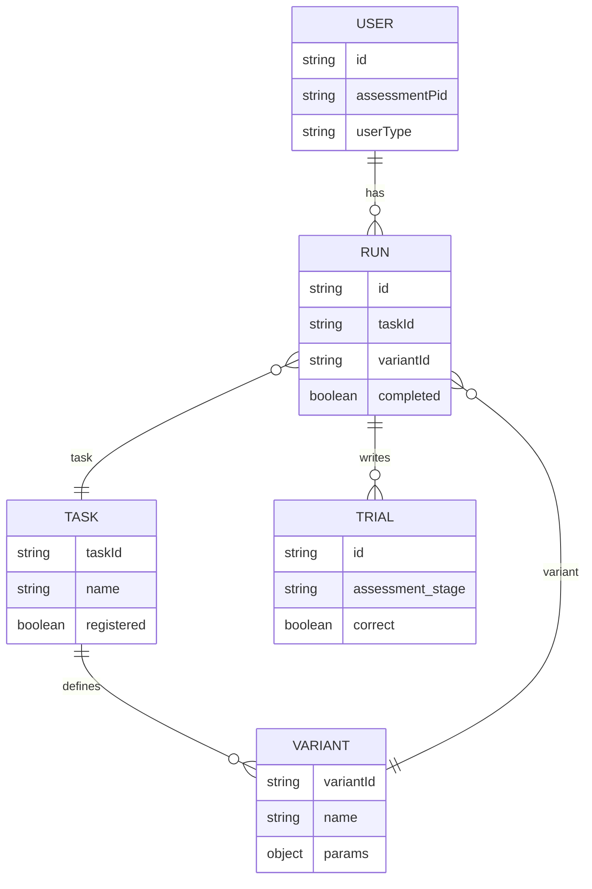

# ROAR Firekit → Levante Schema Mapping (PA, SWR, SRE)

This document maps the Firestore writes performed by `@bdelab/roar-firekit`
to the Levante Firestore schema definitions. It is scoped to the three ROAR tasks:
PA, SWR, and SRE, which all use the same Firekit run lifecycle APIs.

Sources:
- Firekit writes: `~/roar/roar-firekit/src/firestore/app/*.ts`
- Levante schema: `apps/server/levante-firebase-functions/functions/levante-admin/firestore-schema.ts`

## Scope and assumptions

- Firekit writes to the *assessment/app* Firestore database.
- The Levante schema file covers shared structures, but some fields Firekit writes
  are not represented there (notably for app-side collections).

## ERD (Firekit writes)

Generated assets:
- `schema_tools/ROAR_FIREKIT_SCHEMA_MAPPING.erd.mmd`
- `schema_tools/ROAR_FIREKIT_SCHEMA_MAPPING.erd.svg`

## Collection: `tasks/{taskId}`

Firekit writes (from `RoarTaskVariant.toFirestore`):
- `name`, `description`, `image`, `taskURL`, `gameConfig`, `external`,
  `registered`, `lastUpdated`, `testData`, `demoData`

Levante schema (`TaskDoc`):
- `name`, `description`, `image`, `taskURL`, `registered`, `lastUpdated`

Mismatches / deltas:
- Firekit writes `gameConfig`, `external`, `testData`, `demoData` (not in schema).

## Collection: `tasks/{taskId}/variants/{variantId}`

Firekit writes (from `RoarTaskVariant.toFirestore`):
- `name`, `description`, `taskURL`, `external`, `params`, `registered`,
  `lastUpdated`, `testData`, `demoData`

Levante schema (`VariantDoc`):
- `name`, `description`, `taskURL`, `variantURL`, `params`, `registered`, `lastUpdated`

Mismatches / deltas:
- Firekit writes `external`, `testData`, `demoData` (not in schema).
- Schema includes `variantURL` (not written by Firekit).

## Collection: `users/{roarUid}` (or `guests/{assessmentUid}`)

Firekit writes (from `RoarAppUser.updateUser`, `RoarRun.startRun`):
- `assessmentPid`, user metadata (`grade`, `birthMonth`, `birthYear`, `age`, `ageMonths`, ...),
  `tasks`, `variants`, `lastUpdated`, `testData`, `demoData`

Levante schema (`User`, `GuestDoc`):
- `User`: `assessmentUid`, `archived`, org maps, `legal`, `roles`, `userType`, etc.
- `GuestDoc`: `assessmentPid`, `assessmentUid`, `age`, `tasks`, `variants`, `created`, `lastUpdated`

Mismatches / deltas:
- Firekit writes `tasks`/`variants` arrays for users; not present in `User` schema.
- Firekit writes arbitrary user metadata (grade/birth fields) for users;
  these are not represented in `User` schema.
- `GuestDoc` aligns better with Firekit’s guest writes but does not list all
  metadata fields Firekit may include.

## Collection: `users/{roarUid}/runs/{runId}` (and `guests/{guestId}/runs/{runId}`)

Firekit writes (from `RoarRun.startRun`, `addEngagementFlags`, `finishRun`, `writeTrial`):
- `id`, `assignmentId`, `assigningOrgs`, `readOrgs`, `taskId`, `taskVersion`,
  `variantId`, `completed`, `timeStarted`, `timeFinished`, `reliable`,
  `reliableByBlock`, `engagementFlags`, `userData`, `scores.raw.*`,
  `scores.computed.*`, `interactions.*`, `testData`, `demoData`

Levante schema (`RunDoc`):
- `id`, `assignmentId`, `assigningOrgs`, `readOrgs`, `taskId`, `completed`,
  `timeStarted`, `timeFinished`, `reliable`, `scores.raw.*`, `scores.computed.*`,
  `userData.assessmentUid`, `userData.variantId`

Mismatches / deltas:
- Firekit writes `taskVersion`, `variantId`, `reliableByBlock`,
  `engagementFlags`, `interactions.*`, `testData`, `demoData` (not in schema).
- Firekit writes `userData` with additional fields (assessmentPid, grade, birth fields).
- Schema types for `assigningOrgs` / `readOrgs` are `string[] | null`, but
  Firekit writes `OrgLists` objects keyed by org type (classes, schools, etc.).

## Collection: `users/{roarUid}/runs/{runId}/trials/{trialId}`

Firekit writes (from `RoarRun.writeTrial`, `writeInteractions`):
- Required: `assessment_stage`, `correct`
- Optional: `subtask`, `thetaEstimate`, `thetaSE`, `taskId`, `serverTimestamp`,
  interaction arrays (`interaction_blur`, `interaction_focus`, `interaction_fullscreenenter`,
  `interaction_fullscreenexit`), plus task-specific trial payload fields

Levante schema (`TrialDoc`):
- Generic fields only; schema is intentionally flexible with `[key: string]: any`

Mismatches / deltas:
- No structural mismatch expected because `TrialDoc` is intentionally permissive.

## Task-specific differences

- ROAR-PA writes `reliableByBlock` and block-scoped `engagementFlags` for FSM/LSM/DEL.
- ROAR-SWR and ROAR-SRE validate parameters before run start; their Firestore writes
  are otherwise identical to ROAR-PA.
