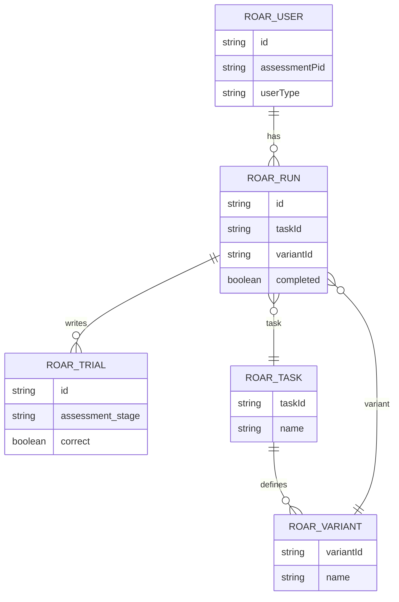

# ROAR Task Dependencies (PA, SWR, SRE)

This document maps ROAR task repos to their Firebase/Firestore dependencies and the
`@bdelab/roar-firekit` APIs they invoke. It is based on source analysis of:

- `~/roar/roar-pa`
- `~/roar/roar-swr`
- `~/roar/roar-sre`
- `~/roar/roar-firekit`

## Quick index

- [Common Firekit usage across tasks](#common-firekit-usage-across-tasks)
- [Firestore paths used by Firekit](#firestore-paths-used-by-firekit)
- [Callable functions exposed by Firekit](#callable-functions-exposed-by-firekit)
- [ROAR-PA dependency map](#roar-pa-dependency-map)
- [ROAR-SWR dependency map](#roar-swr-dependency-map)
- [ROAR-SRE dependency map](#roar-sre-dependency-map)

## Common Firekit usage across tasks

All three tasks depend on `@bdelab/roar-firekit` and call the same core run lifecycle
and data-writing APIs. The concrete Firestore effects are described in the next section.

Shared calls (ROAR-PA, ROAR-SWR, ROAR-SRE):
- `firekit.startRun()`
- `firekit.updateTaskParams(...)`
- `firekit.updateUser(...)`
- `firekit.writeTrial(...)`
- `firekit.finishRun(...)`
- `firekit.updateEngagementFlags(...)`
- `firekit.addInteraction(...)`
- `firekit.abortRun()`

Additional calls used by SWR and SRE only:
- `firekit.validateParameters(parameterSchema)`

## Firestore paths used by Firekit

These are the Firestore collections and documents that the above methods read/write.
Paths are expressed relative to the *assessment/app* Firestore database.

Core collections:
- `users/{roarUid}` (or `guests/{assessmentUid}` for guest users)
- `users/{roarUid}/runs/{runId}`
- `users/{roarUid}/runs/{runId}/trials/{trialId}`
- `tasks/{taskId}`
- `tasks/{taskId}/variants/{variantId}`

Method → Firestore effects:
- `startRun()`
  - Ensures task + variant exist (`tasks/{taskId}`, `tasks/{taskId}/variants/{variantId}`)
  - Creates run doc in `users/{roarUid}/runs/{runId}` with:
    `assignmentId`, `assigningOrgs`, `readOrgs`, `taskId`, `taskVersion`, `variantId`,
    `timeStarted`, `completed`, `reliable`, `userData`, `testData`, `demoData`
  - Updates user doc `users/{roarUid}`:
    `tasks: arrayUnion(taskId)`, `variants: arrayUnion(variantId)`, `lastUpdated`
- `updateTaskParams(newParams)`
  - Updates variant document (`tasks/{taskId}/variants/{variantId}`)
  - Replaces `users/{roarUid}.variants` (remove old, add new)
  - Updates `users/{roarUid}/runs/{runId}.variantId`
- `updateUser({ assessmentPid, ...userMetadata })`
  - Updates `users/{roarUid}` (or `guests/{assessmentUid}`) metadata + `lastUpdated`
- `writeTrial(trialData, computedScoreCallback)`
  - Adds `users/{roarUid}/runs/{runId}/trials/{trialId}`
  - Updates `users/{roarUid}/runs/{runId}` with:
    `scores.raw.*`, `scores.computed.*`, `interactions.*`
- `addInteraction(...)`
  - Writes trial-level interaction arrays (`interaction_blur`, `interaction_focus`, ...)
  - Increments `interactions.{assessmentStage}.{event}` in run doc
- `updateEngagementFlags(flags, reliable, reliableByBlock?)`
  - Updates `users/{roarUid}/runs/{runId}` with `engagementFlags`, `reliable`,
    and optional `reliableByBlock`
- `finishRun(finishingMetaData?)`
  - Updates `users/{roarUid}/runs/{runId}` with `completed: true`, `timeFinished`
  - Updates `users/{roarUid}.lastUpdated`

## Levante schema mapping (PA, SWR, SRE only)

The three ROAR task repos all write to the same *app/assessment* collections in the
Levante schema. The mapping below is limited to these tasks only.

Collection → fields written by Firekit:
- `tasks/{taskId}`
  - `name`, `description`, `image`, `taskURL`, `gameConfig`, `external`,
    `registered`, `lastUpdated`, `testData`, `demoData`
- `tasks/{taskId}/variants/{variantId}`
  - `name`, `description`, `taskURL`, `external`, `params`, `registered`,
    `lastUpdated`, `testData`, `demoData`
- `users/{roarUid}` (or `guests/{assessmentUid}`)
  - `assessmentPid`, user metadata (`grade`, `birthMonth`, `birthYear`, `age`, `ageMonths`, ...),
    `tasks`, `variants`, `lastUpdated`, `testData`, `demoData`
- `users/{roarUid}/runs/{runId}`
  - `id`, `assignmentId`, `assigningOrgs`, `readOrgs`, `taskId`, `taskVersion`,
    `variantId`, `completed`, `timeStarted`, `timeFinished`, `reliable`,
    `reliableByBlock`, `engagementFlags`, `userData`, `scores.raw.*`, `scores.computed.*`,
    `interactions.*`, `testData`, `demoData`
- `users/{roarUid}/runs/{runId}/trials/{trialId}`
  - `assessment_stage`, `correct`, `subtask`, `thetaEstimate`, `thetaSE`, `taskId`,
    trial payload fields, `interaction_blur`, `interaction_focus`,
    `interaction_fullscreenenter`, `interaction_fullscreenexit`,
    `serverTimestamp`, `testData`, `demoData`

Task-specific notes:
- ROAR-PA writes `engagementFlags` and `reliableByBlock` for block-scoped subtasks (FSM/LSM/DEL).
- ROAR-SWR/SRE validate task parameters before run start; Firestore writes are otherwise the same.

## ERD (task data flow)

Generated assets:
- `schema_tools/ROAR_TASK_DEPENDENCIES.erd.mmd`
- `schema_tools/ROAR_TASK_DEPENDENCIES.erd.svg`

Per-task collection matrix:

| Task | Collections touched | Extra Firekit calls | Notes |
| --- | --- | --- | --- |
| ROAR-PA | `tasks`, `tasks/variants`, `users`, `users/runs`, `users/runs/trials` | None beyond shared | Writes `reliableByBlock` for FSM/LSM/DEL engagement flags. |
| ROAR-SWR | `tasks`, `tasks/variants`, `users`, `users/runs`, `users/runs/trials` | `validateParameters` | Parameter validation enforced before start. |
| ROAR-SRE | `tasks`, `tasks/variants`, `users`, `users/runs`, `users/runs/trials` | `validateParameters` | Parameter validation enforced before start. |

## Callable functions exposed by Firekit

While the task repos do not call these directly, the Firekit library bundles several
Firebase Callable Functions used by ROAR admin/dashboard workflows:

- `setUidClaims`
- `syncClassLinkUser`
- `getAdministrations`
- `getTaskBundles`
- `aggregateSupportLevelCategories`
- `verifyParentRegistration`
- `getAdministrationOrgsAndStats`
- `getAssignmentStats`
- `updateUserRecord`
- `batchImportUpdate`
- `createStudentAccount`
- `createNewFamily`
- `createAdministratorAccount`
- `createAdobeSignAgreement`
- `getAdobeSignAgreementStatus`
- `getAdobeSignSigningUrl`
- `createUsers`
- `saveSurveyResponses`
- `createLevanteGroup`
- `linkUsers`

## ROAR-PA dependency map

Repo: `~/roar/roar-pa`  
Firekit dependency: `@bdelab/roar-firekit` (see `package.json`)

Primary call sites:
- `src/index.js` (`RoarPA.run`, `RoarPA.abort`)
- `src/experiment/config/config.js` (`initConfig`, `initRoarJsPsych`, `initRoarTimeline`)
- `src/experiment/experiment.js` (`paValidityEvaluator`, engagement flags)

Firekit calls:
- `startRun()` in `RoarPA.init`
- `updateTaskParams(updatedGameParams)` in `initConfig`
- `updateUser({ assessmentPid, ...userMetadata })` in `initConfig` + `initRoarTimeline`
- `writeTrial(data, computedScoreCallback)` in `initRoarJsPsych.on_data_update`
- `finishRun()` in `initRoarJsPsych.on_finish`
- `addInteraction(data)` in `initRoarJsPsych.on_interaction_data_update`
- `updateEngagementFlags(flags, reliable, reliableByBlock)` in `paHandleEngagementFlags`
- `abortRun()` in `RoarPA.abort`

Firebase project selection:
- `serve/firebaseConfig.js` chooses project by `ROAR_DB` (dev/staging/prod)

Firestore paths touched (via Firekit):
- `users/{roarUid}`
- `users/{roarUid}/runs/{runId}`
- `users/{roarUid}/runs/{runId}/trials/{trialId}`
- `tasks/{taskId}`
- `tasks/{taskId}/variants/{variantId}`

## ROAR-SWR dependency map

Repo: `~/roar/roar-swr`  
Firekit dependency: `@bdelab/roar-firekit` (see `package.json`)

Primary call sites:
- `src/index.js` (`RoarSWR.run`, `RoarSWR.abort`)
- `src/experiment/config/config.js` (`initConfig`, `initRoarJsPsych`, `initRoarTimeline`)
- `src/experiment/experiment.js` (`swrValidityEvaluator`, engagement flags)

Firekit calls:
- `startRun()` in `RoarSWR.init`
- `updateTaskParams(updatedGameParams)` in `initConfig`
- `validateParameters(parameterSchema)` in `initConfig`
- `updateUser({ assessmentPid, ...userMetadata })` in `initConfig` + `initRoarTimeline`
- `writeTrial(data, computedScoreCallback)` in `initRoarJsPsych.on_data_update`
- `finishRun()` in `initRoarJsPsych.on_finish`
- `addInteraction(data)` in `initRoarJsPsych.on_interaction_data_update`
- `updateEngagementFlags(flags, reliable)` in `swrHandleEngagementFlags`
- `abortRun()` in `RoarSWR.abort`

Firebase project selection:
- `serve/firebaseConfig.js` chooses project by `ROAR_DB` (dev/emulator/staging/prod)

Firestore paths touched (via Firekit):
- `users/{roarUid}`
- `users/{roarUid}/runs/{runId}`
- `users/{roarUid}/runs/{runId}/trials/{trialId}`
- `tasks/{taskId}`
- `tasks/{taskId}/variants/{variantId}`

## ROAR-SRE dependency map

Repo: `~/roar/roar-sre`  
Firekit dependency: `@bdelab/roar-firekit` (see `package.json`)

Primary call sites:
- `src/index.js` (`RoarSRE.run`, `RoarSRE.abort`)
- `src/experiment/config/config.js` (`initConfig`, `initRoarJsPsych`, `initRoarTimeline`)
- `src/experiment/experiment.js` (`sreValidityEvaluator`, engagement flags)

Firekit calls:
- `startRun()` in `RoarSRE.init`
- `updateTaskParams(updatedGameParams)` in `initConfig`
- `validateParameters(parameterSchema)` in `initConfig`
- `updateUser({ assessmentPid, ...userMetadata })` in `initConfig` + `initRoarTimeline`
- `writeTrial(data, computedScoreCallback)` in `initRoarJsPsych.on_data_update`
- `finishRun()` in `initRoarJsPsych.on_finish`
- `addInteraction(data)` in `initRoarJsPsych.on_interaction_data_update`
- `updateEngagementFlags(flags, reliable)` in `sreHandleEngagementFlags`
- `abortRun()` in `RoarSRE.abort`

Firebase project selection:
- `serve/firebaseConfig.js` chooses project by `ROAR_DB` (dev/emulator/staging/prod)

Firestore paths touched (via Firekit):
- `users/{roarUid}`
- `users/{roarUid}/runs/{runId}`
- `users/{roarUid}/runs/{runId}/trials/{trialId}`
- `tasks/{taskId}`
- `tasks/{taskId}/variants/{variantId}`
